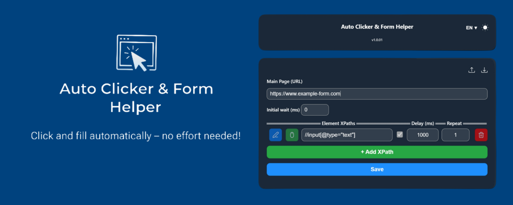

# Auto Clicker & Form Helper

 Uma extensão poderosa para o Google Chrome, desenvolvida para **automatizar cliques e preenchimento de formulários** em sites e iframes dinâmicos. O Auto Clicker & Form Helper otimiza sua produtividade, simplificando tarefas repetitivas na web de forma prática e intuitiva.

## ✨ Recursos

* **Automação de Cliques Precisa:** Injete e execute cliques automáticos em qualquer elemento, usando XPaths para identificação exata.
* **Preenchimento de Formulários Inteligente:** Preencha campos de texto, e-mails, senhas, selecione opções em dropdowns e marque radio buttons automaticamente.
* **Suporte a Iframes Dinâmicos:** Funciona perfeitamente dentro de iframes, mesmo aqueles carregados dinamicamente.
* **Configurações Flexíveis de Tempo:** Controle o início da automação (Espera Inicial global) e o intervalo entre as ações de cada XPath (Inter. [ms]).
* **Controle de Repetições:** Defina quantas vezes um XPath específico deve ser clicado, incluindo opções para cliques únicos em múltiplos elementos ou loops infinitos.
* **Armazenamento Local e Seguro:** Todas as suas configurações e XPaths são armazenados exclusivamente de forma local no seu navegador, garantindo privacidade e segurança.
* **Importação/Exportação de Configurações:** Faça backup, restaure ou compartilhe suas automações através de arquivos JSON.
* **Interface Intuitiva:** Desenhada para ser fácil de usar, mesmo para quem não tem experiência prévia com automação.
* **Tema Claro/Escuro & Alternância de Idioma:** Personalize a aparência e o idioma da interface para uma experiência de usuário mais agradável.

## 🚀 Instalação

A maneira mais fácil e segura de obter a extensão é através da Chrome Web Store.

1.  **Acesse a Chrome Web Store:**
    [Clique aqui para ir para a página da extensão](https://chromewebstore.google.com/detail/jgkeppcdhlodchbjljdiajbieephocnb?utm_source=item-share-cb)
2.  **Adicionar ao Chrome:**
    Na página da extensão, clique no botão "Usar no Chrome" (ou "Adicionar ao Chrome"). Confirme a instalação quando solicitado.
3.  **Fixar na Barra de Ferramentas:**
    Após a instalação, clique no ícone de "quebra-cabeça" (Extensões) na sua barra de ferramentas do Chrome e fixe o ícone do "Auto Clicker & Form Helper" para acesso rápido.

## 💡 Como Usar

A interface do Auto Clicker & Form Helper é acessível clicando no ícone da extensão na barra de ferramentas do Chrome.

### Seção Principal de Configuração

* **Página Principal (URL):**
    Este campo é onde você define a URL da página onde a automação será executada. É fundamental preencher este campo. A extensão ativará as configurações salvas para a URL especificada quando você visitar essa página.
    * Exemplo: `http://www.exemplo.com` ou `https://meuaplicativo.com/dashboard`

* **Espera Inicial (ms):**
    Defina um tempo de espera em milissegundos (ms) antes que a automação comece a executar os **primeiros cliques de toda a sequência de XPaths**. Esta é uma **espera global** para todas as ações configuradas.
    * Útil para garantir que a página esteja totalmente carregada e pronta para interações antes que qualquer automação seja iniciada.
    * Valor Padrão: `0` (cliques iniciam imediatamente).

### Seção de XPaths dos Elementos

Esta é a parte central da sua automação, onde você define quais elementos serão clicados/preenchidos e como.

* **Adicionar XPath:**
    Clique no botão verde "+ Adicionar XPath" para adicionar uma nova linha de configuração de XPath. Você pode adicionar quantos XPaths precisar (até um limite alto de 9999999).

* **Configurando cada XPath:**

    * **Campo de Texto (XPath):** Insira o XPath do elemento que você deseja que a extensão clique ou interaja.
        * **Obtendo XPaths Automaticamente (Recurso "Carregar XPath"):** Para usar o recurso de "Carregar XPath" diretamente do menu de contexto do navegador (clique direito), siga estes passos de configuração apenas na primeira vez para uma nova URL:
            1.  Na popup da extensão, preencha o campo "Pagina Principal (URL)" com a URL da página que você deseja automatizar.
            2.  Adicione um XPath inicial qualquer (sugestão: `/html/body` ou um XPath de um elemento existente na página, como um botão) na seção "XPath dos elementos" e certifique-se de que o checkbox esteja marcado. Este passo é crucial para que a extensão injete seu script na página.
            3.  Clique em "Salvar".
            4.  Recarregue a página do navegador (usando F5 ou o botão de recarregar do Chrome). Isso garante que o script da extensão seja injetado corretamente.
            5.  Após a página carregar e o script da extensão estar ativo, clique com o botão direito do mouse sobre o elemento da página que você deseja automatizar (um botão, um link, etc.).
            6.  No menu de contexto que aparecer, você verá a opção "Carregar XPath - Auto Clicker Xpath". Clique nela.
            7.  O XPath do elemento clicado será automaticamente preenchido em um novo campo na sua lista de XPaths na popup da extensão. Você pode então ajustar este XPath e salvar suas configurações.
        * **Dica Alternativa (Manual):** Para obter o XPath manualmente (sem o recurso "Carregar XPath"):
            1.  Navegue até a página desejada.
            2.  Clique com o botão direito do mouse no elemento que você quer automatizar (botão, link, etc.).
            3.  Selecione "Inspecionar" (ou "Inspect Element").
            4.  No painel do desenvolvedor que se abre (geralmente à direita ou embaixo), clique com o botão direito do mouse sobre a linha de código HTML do elemento.
            5.  Vá em "Copy" (Copiar) e selecione "Copy XPath" (Copiar XPath). Cole esse valor no campo de texto da extensão.
        * **Importante:** Se um XPath corresponder a múltiplos elementos na página, a extensão interagirá apenas com o primeiro elemento encontrado que corresponda ao XPath.
            * Exemplo: `//button[@id='start']`, `//a[contains(text(),'Próxima Página')]`, `//*[@class='confirm-button']`

    * **Checkbox:** Marque ou desmarque para ativar ou desativar um XPath específico em sua sequência de automação. Pelo menos um XPath deve estar ativo para que a automação possa iniciar.

    * **Inter. (ms) (Intervalo):** Defina o tempo de espera em milissegundos (ms) **APÓS a interação com este XPath específico e ANTES de prosseguir para o próximo XPath** na sequência. Esta é a **espera individual** responsável por cada XPath.
        * Este intervalo garante que a página tenha tempo para reagir à ação anterior (por exemplo, um clique que carregou um novo conteúdo ou uma animação).
        * Valor Padrão: `1000` (1 segundo).
        * Mínimo: `1 ms`.

    * **Repet. (Repetições):** Defina quantas vezes este XPath específico será clicado/interagido.
        * Valor Padrão: `5` repetições.
        * **Valores Especiais:**
            * `-2`: Indica que o XPath será clicado **infinitamente** (loop contínuo) até que a automação seja pausada manualmente, a página seja recarregada ou a extensão seja desativada.
            * `1`: Indica que o XPath será clicado **uma única vez para cada elemento encontrado** que corresponda ao XPath na página. Por exemplo, se o XPath selecionar 3 botões (que possuem o mesmo XPath), a extensão clicará nos 3, uma vez cada, antes de passar para o próximo XPath na sequência.
            * Qualquer número positivo: O XPath será clicado esse número exato de vezes.

### Gerenciamento de Configurações

* **Salvar:** Clique no botão azul "Salvar" para guardar todas as suas configurações atuais (URL da página principal, espera inicial e todos os XPaths de clique configurados). Uma mensagem de confirmação "✔ Configurações salvas!" aparecerá na parte inferior da popup.
* **Apagar Configurações (Ícone de Lixeira):** Localizado no canto superior direito da seção de configuração (o ícone de lixeira vermelha). Ao clicar, será solicitada uma confirmação para apagar **todas as configurações salvas para a URL atual**. Use com cautela!
* **Exportar Configurações (Ícone de Seta para Cima):** Clique neste ícone (seta apontando para cima) para baixar um arquivo JSON (`.json`) contendo suas configurações atuais. Isso é útil para fazer backup de suas automações ou para compartilhá-las com outros usuários.
    * **Observação:** Para exportar, o campo "Pagina Principal (URL)" deve estar preenchido.
* **Importar Configurações (Ícone de Seta para Baixo):** Clique neste ícone (seta apontando para baixo) para carregar um arquivo JSON de configurações previamente exportadas. Isso aplicará as configurações salvas no arquivo à sua extensão, substituindo as configurações atuais.

### Outras Opções

* **Alternar Idioma (PT ▼):** O botão com o código do idioma (ex: "PT ▼") permite alternar o idioma da interface da extensão entre Português e Inglês.
* **Alternar Tema (Ícone de Sol/Lua):** O ícone de sol/lua (localizado ao lado da opção de idioma) permite alternar entre o tema claro e escuro da interface da extensão, adaptando-se às suas preferências visuais.

## 🎯 XPaths e Automação

Os XPaths são essenciais para a extensão localizar e interagir com os elementos na página. Alguns exemplos de XPaths comuns:

* **Campo de Texto por `id`:** `//input[@id='nome-completo']`
* **Botão por texto:** `//button[text()='Enviar']`
* **Link por `href`:** `//a[@href='/minha-pagina']`
* **Dropdown (selecionar opção por valor):** `//select[@id='tamanho']/option[@value='M']`
* **Radio Button por `value`:** `//input[@type='radio' and @name='genero' and @value='feminino']`

## 🧪 Demonstração Online

Visite nossa seção de teste para experimentar a funcionalidade da extensão em tempo real:

[Acesse a Seção de Teste](https://boydayno10.github.io/Auto_Click_Iframe/#teste) Nesta seção, você encontrará diversos campos de formulário e botões com seus XPaths correspondentes para praticar a automação.

## 🔒 Política de Privacidade

Sua privacidade é nossa prioridade. A extensão "Auto Clicker & Form Helper" **não coleta, armazena, monitora, transmite ou compartilha quaisquer dados pessoais identificáveis ou informações de navegação** com o desenvolvedor ou terceiros. Todas as configurações e dados inseridos pelo usuário são armazenados **exclusivamente de forma local** no seu navegador (utilizando a API `chrome.storage.local`). Para mais detalhes, consulte nossa [Política de Privacidade](https://boydayno10.github.io/Auto_Click_Iframe/#politicas). ## 🤝 Contribuição

Atualmente, não aceitamos contribuições externas. No entanto, feedback e sugestões são sempre bem-vindos!

## 📜 Licença

Este projeto é distribuído sob a licença [MIT License](https://opensource.org/licenses/MIT).

## 📧 Contato

Para dúvidas, sugestões ou suporte, entre em contato:

**E-mail:** sdankhey848@gmail.com